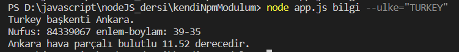

# ***NODEJS CONSOL ÜZERİNDEN ULKE BİLGİSİ VE HAVADURUMU ÖĞRENME***

  

<b>-> Bu uygulama ile consol üzerinden ülkenin adını gönderip,ülkenin bilgisini ve hava durumunu alabiliriz. </b>
  

-> Bu proje NODEJS ile yapılmıştır.. 
-> Hava durumu ve ülke bilgisi(enlem/boylam vs) için API kaynaklarından verş çekilmektedir! 
-> Bilgisine erişilmek istenen ülkenin adının console üzerinden gönderilmesi yeterlidir!
 

<b>Bu proje NPM KÜTÜPHANESİNE modül olarak eklenmiştir. İstenildiğinde npm install ile istenilen projeye eklenebilir!</b>

 
 

    <h6>Consol:</h6> 
      

